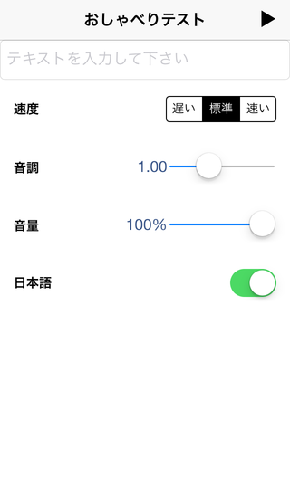

SpeechSample
===========

AVSpeechSynthesizer のサンプルソースコード。とりあえず、AVSpeechSynthesizer がどういうものかを知るには便利かな。

Features
========

 - AVSpeechUnterance のパラメータを調整して実行可能
 - 日本語と英語のスピーチに対応（デフォルトは日本語）

Requirements
============

 - ARC
 - iOS 7.0
 - Xcode 5.0.2

Screen Shot
============

